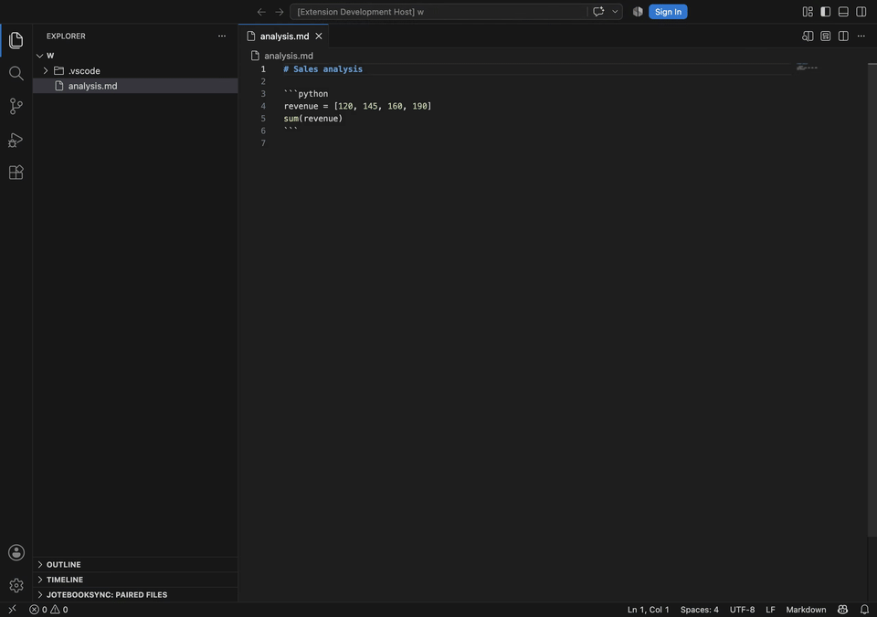
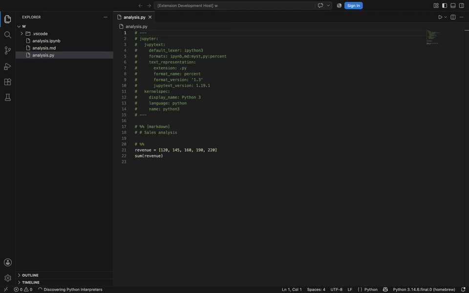
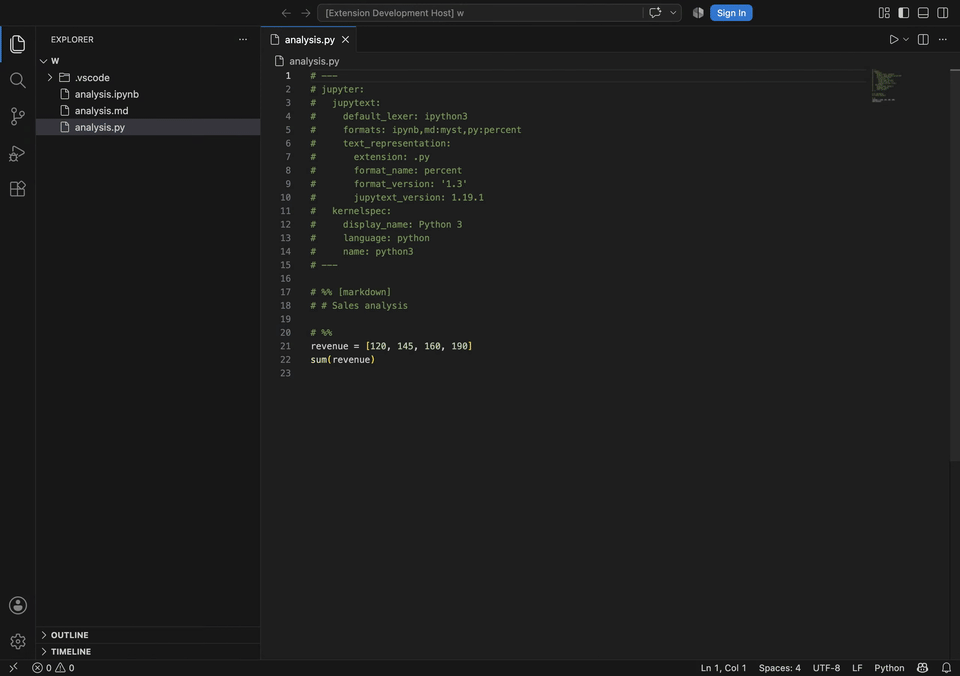
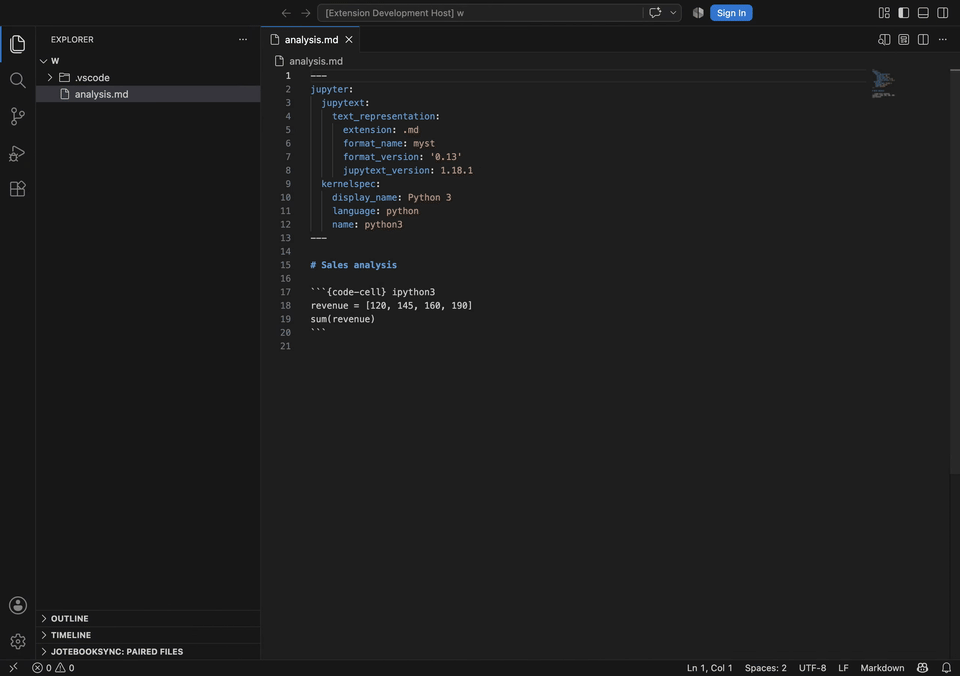
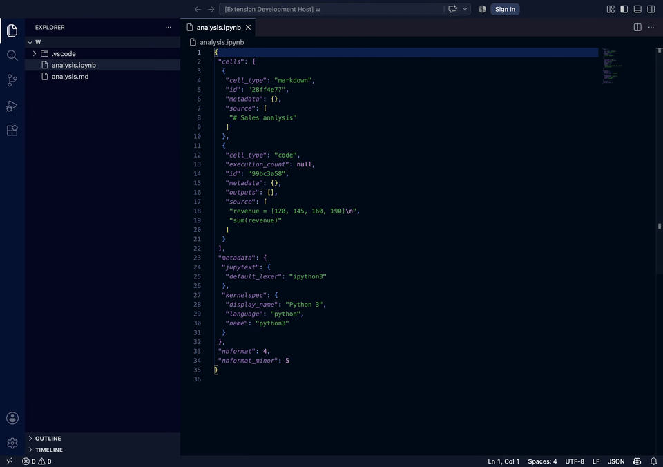
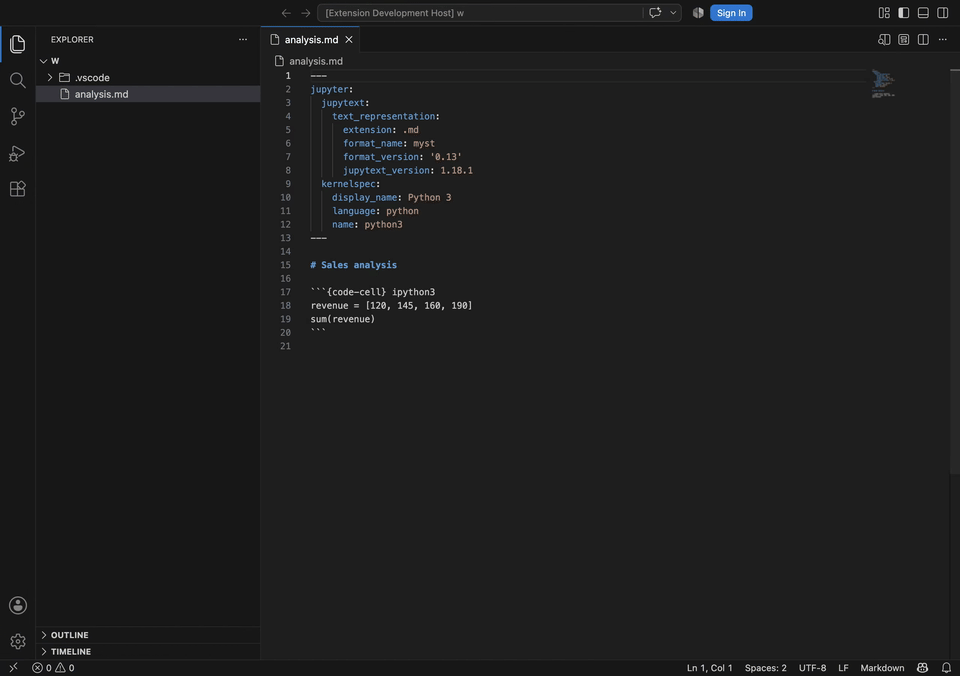
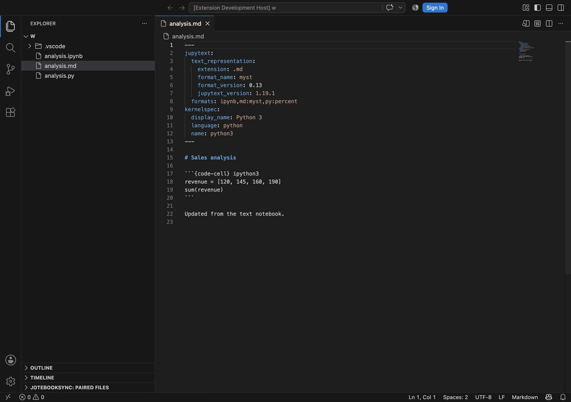
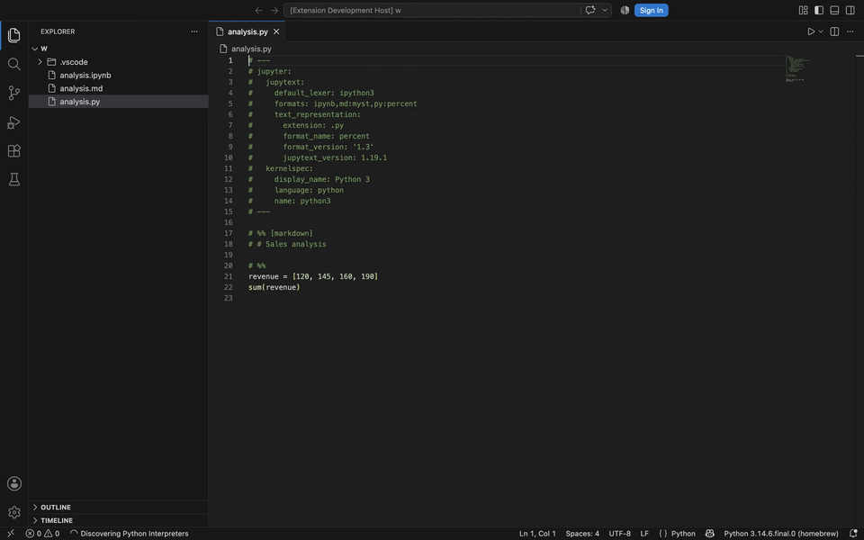
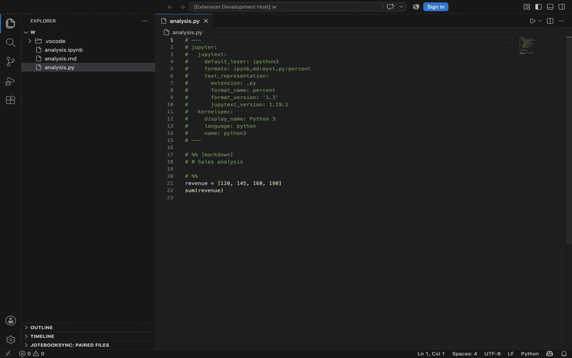

# JotebookSync

**Keep Jupyter notebooks easy to run, easy to review, and easy to maintain.**

JotebookSync brings Jupytext workflows into VS Code so you can pair notebooks
with readable source files, keep representations synchronized, review
differences before overwriting files, and manage notebook workflows without
leaving the editor.



## Install

Install **JotebookSync** from the VS Code Extensions view.

JotebookSync uses the Microsoft Python and Jupyter extensions and requires
Python with Jupytext available in the environment you want to use.

If Jupytext is missing, JotebookSync can guide you through installing it in the
selected Python environment.

## Why pair notebooks with source files?

An `.ipynb` file is ideal for running cells and keeping rich output, but its
JSON is difficult to review in Git and awkward to edit with normal development
tools.

A paired text representation gives you both:

- notebook outputs for exploration, analysis, and presentation;
- readable Git diffs for code review;
- normal search, formatting, refactoring, and source-control workflows;
- Python, Markdown, MyST, Quarto, R Markdown, Julia, and other Jupytext formats.

For example:

```text
analysis.ipynb  ⇄  analysis.py
```

The notebook keeps outputs while the paired Python file stays easy to review.

## Create your first pair

1. Open a notebook or supported text notebook.
2. Right-click it in Explorer.
3. Choose **JotebookSync → Configure Paired Files…**.
4. Select the representations you want.
5. Choose **Create pair**.

JotebookSync discovers formats from the active Jupytext environment instead of
using a fixed language list. You can also enter a Jupytext format code directly,
such as `py:percent`, `md:myst`, `Rmd`, or `qmd`.

## Keep paired files synchronized

Automatic sync on save is enabled by default. Edit a notebook or one of its
paired text representations and save; JotebookSync updates the rest of the pair.

When you want explicit control, use:

- **Sync All from Newest Paired File…** to use the most recently modified file;
- **Overwrite Paired Files from This File…** to make the selected file the
  source of truth.




## Review before you overwrite

Use **Review Pair Freshness…** when you want to see which representation is
newest before synchronizing.

The freshness view shows timestamps, stale files, recommended actions, and
targeted sync controls. You can also open a normalized VS Code diff.

Normalized diffs convert both sides to a comparable Jupytext representation
first, so you review notebook content instead of unrelated serialization
differences.



For additional confidence, you can test whether a representation survives
conversion to another format and back.


## Use the format that fits your workflow

Choose a discovered format in the guided setup page or enter any Jupytext format
code supported by your environment.



Need a one-time representation without creating a pair? Use **Convert File to
Another Format…**.

The conversion page lets you choose the target format, preview the destination
filename, and create the file without changing pairing metadata.



## Create or update notebooks from text

Use **Create Notebook from Text File…** to create an independent `.ipynb`
notebook from a supported text representation.



Use **Update Existing Notebook from Text File…** to update notebook inputs and
metadata while preserving saved cell outputs.



## Configure an entire project

Right-click a workspace folder and choose **Create Project Pairing
Configuration…** to create `jupytext.toml`.

You can apply the configuration immediately or use **Apply Project Pairing
Configuration…** later to configure existing notebooks.

Jupytext folder mappings are supported, so notebook and text representations do
not have to live in the same directory.


## Manage every pair from Explorer

The **JotebookSync: Paired Files** Explorer view groups discovered pairs across
the workspace.

From the view you can:

- open a representation;
- open the paired notebook;
- review freshness;
- synchronize the pair;
- change pair configuration;
- detach one representation;
- remove the full pairing.

Pair removal changes Jupytext pairing metadata; it does not delete your files.





## Advanced Jupytext tools

JotebookSync also exposes additional Jupytext workflows through VS Code:

- format notebook text with Black;
- run round-trip and strict round-trip checks;
- pipe content through an external command;
- validate content with `--check`;
- set the notebook kernel;
- execute notebook cells;
- update notebook metadata;
- update format options;
- run pre-commit workflows;
- run advanced Jupytext arguments directly.

External commands and notebook execution can run arbitrary code, so
JotebookSync asks for confirmation where appropriate.

## Safety

Destructive actions require confirmation by default.

This includes operations that replace paired content, replace an existing
notebook, remove pairing metadata, or replace project configuration.

If you are unsure which file should win, use **Review Pair Freshness…** before
forcing synchronization.

## Requirements

- VS Code
- Microsoft Python extension
- Microsoft Jupyter extension
- Python
- Jupytext

JotebookSync can also provide targeted guidance when optional tools are needed:

- Quarto output requires the Quarto CLI.
- Marimo output requires the `marimo` Python package.
- **Format with Black** requires the `black` Python package.
- notebook execution features may require `jupyter_client`.

## VS Code settings

Open **Settings** and search for **JotebookSync** to configure the extension from
the VS Code Settings UI.

You can also edit the same options in `settings.json`.

### Recommended defaults

```json
{
  "jotebooksync.autoSyncOnSave": true,
  "jotebooksync.confirmDestructiveActions": true,
  "jotebooksync.pythonPath": "python",
  "jotebooksync.notebookEditorViewType": "jupyter-notebook",
  "jotebooksync.supportedTextExtensions": [],
  "jotebooksync.syncArgs": [],
  "jotebooksync.setFormatsArgs": []
}
```

### Available settings

| Setting | Default | What it controls |
| --- | --- | --- |
| `jotebooksync.autoSyncOnSave` | `true` | Keeps paired files synchronized whenever a paired notebook or text file is saved. |
| `jotebooksync.confirmDestructiveActions` | `true` | Asks before removing pairing metadata or replacing notebook, paired-file, or project configuration content. |
| `jotebooksync.pythonPath` | `python` | Python executable used to run Jupytext. When left as `python`, JotebookSync can fall back to the active interpreter from the Microsoft Python extension. |
| `jotebooksync.notebookEditorViewType` | `jupyter-notebook` | VS Code editor view type used when opening `.ipynb` files. |
| `jotebooksync.supportedTextExtensions` | `[]` | Optional override for text extensions handled by JotebookSync. Leave empty to use extensions reported by the installed Jupytext environment. |
| `jotebooksync.syncArgs` | `[]` | Extra arguments appended to `jupytext --sync`. |
| `jotebooksync.setFormatsArgs` | `[]` | Extra arguments passed before `--set-formats` when changing pair formats. |

### Common examples

Disable automatic synchronization:

```json
{
  "jotebooksync.autoSyncOnSave": false
}
```

Use a specific Python environment:

```json
{
  "jotebooksync.pythonPath": "/path/to/venv/bin/python"
}
```

Allow only selected text extensions:

```json
{
  "jotebooksync.supportedTextExtensions": [
    "py",
    "md",
    "qmd"
  ]
}
```

Pass additional arguments to Jupytext synchronization:

```json
{
  "jotebooksync.syncArgs": [
    "--update"
  ]
}
```

## Troubleshooting

**A format is missing:** Run **JotebookSync: Refresh Available Formats** after
changing Python environments or installing a dependency.

**Saving did not synchronize the pair:** Confirm that **Auto Sync On Save** is
enabled and that the selected environment can run
`python -m jupytext --version`.

**Quarto or Marimo is unavailable:** Follow the installation guidance in the
error message, then retry.

**You are not sure which file should win:** Open **Review Pair Freshness…** and
compare the pair before overwriting anything.

## Privacy

Pairing, conversion, comparison, and synchronization run locally through the
selected Python environment. JotebookSync does not upload notebook contents.

JotebookSync integrates with Jupytext but is not affiliated with or currently
endorsed by the Jupytext project.

## Documentation

More detailed guides and command/reference documentation are available in
[`docs/`](docs/page.mdx).

## License

[MIT](LICENSE)
